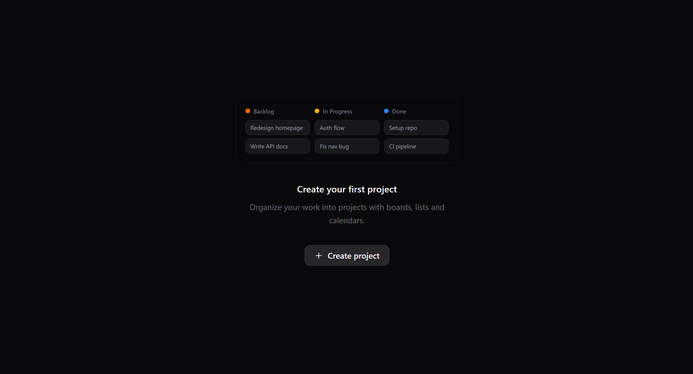

<div align="center">

# 🧠 Digital Second Brain

### A Production-Grade Personal Productivity Platform

*Combining professional task management, real-time sports tracking, and entertainment library in a single, modern web application*

[](https://nextjs.org/)
[](https://www.typescriptlang.org/)
[](https://supabase.com/)
[](https://tailwindcss.com/)

**[📖 Read Documentation](#-architecture) • [🎨 View Screenshots](#-screenshots) • [🚀 Quick Start](#-getting-started)**

</div>

---

## 📊 Project Metrics
```
📦 Monorepo Size        │ 50,000+ lines of TypeScript
🗄️ Database Tables      │ 25+ tables with full RLS policies
⚡ Edge Functions       │ 3 Deno functions with cron automation
🎨 UI Components        │ 40+ custom components + shadcn/ui
📱 Responsive Views     │ 100% mobile-first design
🔐 Security             │ Row-Level Security on every table
```

---

## 🎯 What Makes This Project Stand Out

> **Not just another todo app.** This is a full-stack, production-ready platform demonstrating advanced Next.js 14 patterns, real-time data sync, and enterprise-level architecture.

### 🏆 Technical Highlights

- ✅ **Next.js 14 App Router** with React Server Components & Server Actions
- ✅ **Type-safe end-to-end** with TypeScript strict mode + Zod validation
- ✅ **Real-time data sync** via Supabase Edge Functions + Cron Jobs
- ✅ **Optimistic UI updates** with TanStack React Query v5
- ✅ **Linear-inspired UX** with smooth animations (Framer Motion) and keyboard shortcuts
- ✅ **Scalable architecture** with modular components and separation of concerns
- ✅ **Production-ready patterns** including error boundaries, loading states, and empty states

---

## 📸 Screenshots

### 🎯 Tasks Manager — Linear-Inspired Interface

<table>
<tr>
<td width="100%">

#### Kanban Board with Drag & Drop


**Features:**
- Smooth drag-and-drop with `dnd-kit`
- Optimistic updates (instant UI feedback)
- Column-based workflow (Backlog → In Progress → Done)
- Priority indicators with color coding
- Task quick actions (edit, delete, duplicate)

</td>
</tr>
<tr>

<td width="100%">

#### Calendar View with Task Mini-Cards


**Features:**
- Monthly grid with task previews
- Date-based filtering (select any date)
- Status badges for quick identification
- Responsive touch interactions
- Empty state with "Create Task" CTA

</td>
</tr>


<tr>
<td width="100%">

#### List View — Grouped by Status


**Features:**
- Collapsible sections per status
- Bulk actions (select multiple tasks)
- Advanced filters (priority, tags, search)
- Nested dropdown menus (Linear-style)
- Keyboard navigation support

</td>
</tr>

<tr>
<td width="100%">

#### Auto-Setup Onboarding Flow
*First-time users get automatic workspace creation*


**Features:**
- Zero-config onboarding
- Default project + statuses setup
- Clean empty states with visual guidance
- Skeleton loading for progressive enhancement

</td>
</tr>
</table>

---

### ⚽ Football — Live Data with Interactive Features

<table>
<tr>
<td width="100%">

#### Live Standings & Match Results


**Features:**
- Real-time league standings (points, GD, form)
- Recent match results with scores
- Automatic data sync via cron jobs
- Competition logos and team crests
- Responsive card-based layout

</td>
</tr>
<tr>
<td width="100%">

#### Best XI Builder — Interactive Pitch


**Features:**
- Drag-and-drop player positioning
- 4-3-3 formation layout
- Player cards with photos & names
- Add/remove players dynamically
- Local state management with Zustand

</td>
</tr>
</table>

---

### 🎾 Tennis — ATP/WTA Rankings & Live Matches


**Features:**
- Top 20 ATP/WTA rankings with movement indicators
- Live match scores with set-by-set breakdown (tie-break support with Unicode superscripts)
- Upcoming tournaments with surface info (Clay, Hard, Grass, Indoor)
- Surface-specific gradient designs
- Edge Function sync for match status transitions

---

### 🏎️ Formula 1 2026 — Driver & Constructor Standings


**Features:**
- Driver standings (points, wins, team)
- Constructor standings (team rankings)
- Race results with automated Jolpica API sync
- Sunday/Monday cron jobs for live race updates
- Schema-specific Supabase client (`db: { schema: "sport" }`)

---

### 📺 Watching Tracker — Movies, Series & Anime

<table>
<tr>
<td width="100%">

#### Movies Collection


</td>
</tr>
<tr>
<td width="100%">

#### Series Library


</td>
</tr>
<tr>
<td width="100%">

#### Anime Tracker


</td>
</tr>

<tr>
<td>


**Features:**
- TMDB API integration (automatic metadata fetching)
- Status management (Watching, Completed, Plan to Watch, Dropped)
- Card-based layout with hover effects
- Filters by genre, year, and rating
- Personal collections (Best 10, Recently Watched, Watchlist)

</td>
</tr>
</table>


---

## 🛠️ Tech Stack

<table>
<tr>
<td>

### Frontend
- **Framework:** Next.js 14 (App Router)
- **Language:** TypeScript 5.0
- **Styling:** Tailwind CSS + shadcn/ui
- **Animations:** Framer Motion
- **Drag & Drop:** dnd-kit
- **State:** Zustand + React Query v5

</td>
<td>

### Backend
- **Database:** Supabase (PostgreSQL)
- **Auth:** Supabase Auth (Row-Level Security)
- **Edge Functions:** Deno (TypeScript)
- **Cron Jobs:** Supabase Scheduler
- **APIs:** API-Football, Jolpica, TMDB

</td>
</tr>
</table>

---

## 🏗️ Architecture

### High-Level System Design
```
┌─────────────────────────────────────────────────────────────┐
│                        External APIs                        │
│  (API-Football, Jolpica F1, TMDB)                           │
└──────────────────────┬──────────────────────────────────────┘
                       │
                       ▼
┌─────────────────────────────────────────────────────────────┐
│              Supabase Edge Functions (Deno)                 │
│  • sync-f1-race-results (Sun/Mon cron)                      │
│  • sync-tennis-matches (status transitions)                 │
│  • sync-football-data (live standings)                      │
└──────────────────────┬──────────────────────────────────────┘
                       │
                       ▼
┌─────────────────────────────────────────────────────────────┐
│            Supabase PostgreSQL (25+ tables)                 │
│  • sport schema (football, tennis, f1)                      │
│  • tasks schema (workspaces, projects, tasks)               │
│  • watching schema (movies, series, anime)                  │
└──────────────────────┬──────────────────────────────────────┘
                       │
                       ▼
┌─────────────────────────────────────────────────────────────┐
│           Next.js 14 Server Components (RSC)                │
│  • Async data fetching in server                            │
│  • Progressive loading with Suspense                        │
│  • Server Actions for mutations                             │
└──────────────────────┬──────────────────────────────────────┘
                       │
                       ▼
┌─────────────────────────────────────────────────────────────┐
│                   Client Components                         │
│  • Optimistic updates (React Query)                         │
│  • Interactive UIs (dnd-kit, Framer Motion)                 │
│  • Zustand for local state                                  │
└─────────────────────────────────────────────────────────────┘
```

### Key Design Decisions

1. **Server Components First**
   - All data fetching happens server-side
   - Minimal client-side JavaScript
   - Suspense boundaries for progressive loading

2. **Single Skeleton Pattern**
   - One skeleton component per view
   - Prevents double loading states
   - Managed in `PageWrapper` files

3. **Schema-Based Supabase Organization**
   - `sport` schema for all sports data
   - `tasks` schema for task management
   - `watching` schema for entertainment tracking
   - **Critical:** All Edge Functions must use `db: { schema: "sport" }`

4. **Optimistic UI Updates**
   - React Query mutation callbacks
   - Instant UI feedback before server response
   - Automatic rollback on error

5. **Type Safety End-to-End**
   - Supabase types generated from database
   - Zod schemas for validation
   - TypeScript strict mode enabled

---

## 🚀 Getting Started

### Prerequisites
```bash
Node.js 18+
npm or yarn
Supabase account (free tier works)
API keys: API-Football, TMDB
```

### Quick Start
```bash
# 1. Clone the repository
git clone https://github.com/ZejlyZakaria/digital-second-brain.git
cd digital-second-brain

# 2. Install dependencies
npm install

# 3. Set up environment variables
cp .env.example .env.local
# Fill in: NEXT_PUBLIC_SUPABASE_URL, NEXT_PUBLIC_SUPABASE_ANON_KEY, etc.

# 4. Run database migrations
# Go to Supabase Dashboard → SQL Editor
# Run all migrations in supabase/migrations/

# 5. (Optional) Seed the database
# Run tasks-seed-FINAL.sql in SQL Editor

# 6. Start development server
npm run dev

# 7. Open http://localhost:3000
```

---

## 📁 Project Structure
```
digital-second-brain/
├── app/                      # Next.js 14 App Router
│   ├── tasks/                # PRO Tasks Manager section
│   │   ├── kanban/
│   │   ├── calendar/
│   │   └── list/
│   ├── sport/                # Sport tracking section
│   │   ├── football/
│   │   ├── tennis/
│   │   └── f1/
│   └── watching/             # Entertainment tracker
├── components/
│   ├── tasks/                # Task-specific components
│   │   ├── kanban/
│   │   ├── calendar/
│   │   ├── list/
│   │   ├── modals/
│   │   └── TasksSkeletons.tsx
│   ├── sport/                # Sport-specific components
│   └── ui/                   # shadcn/ui base components
├── lib/
│   ├── tasks/
│   │   ├── queries/          # React Query hooks
│   │   ├── actions/          # Server Actions
│   │   ├── stores/           # Zustand stores
│   │   └── types/            # TypeScript types
│   ├── supabase/             # Supabase clients (client, server, admin)
│   └── utils/                # Shared utilities
├── supabase/
│   ├── functions/            # Edge Functions (Deno)
│   │   ├── sync-f1-race-results/
│   │   ├── sync-tennis-matches/
│   │   └── sync-football-data/
│   └── migrations/           # Database migrations
└── public/
    └── screenshots/          # README images
```

---

## 🔐 Security Features

- ✅ **Row-Level Security (RLS)** on ALL tables
- ✅ **User isolation** (users can only see their own data)
- ✅ **API keys in environment variables** (never committed to Git)
- ✅ **Server Actions with validation** (Zod schemas)
- ✅ **Supabase Auth** with magic links

---

## 🚧 Roadmap

### 🎯 Tasks Manager
- [ ] Subtasks (parent-child relationships)
- [ ] Time tracking with start/stop timers
- [ ] Task dependencies (blockers)
- [ ] Custom fields (text, number, date, select)
- [ ] Keyboard shortcuts (Linear-style)
- [ ] Team collaboration (assign tasks to users)

### ⚽ Sport Section
- [ ] More sports (NBA, NFL, Cricket)
- [ ] Player statistics & comparisons
- [ ] Live match notifications
- [ ] Head-to-head records

### 📺 Watching Tracker
- [ ] Recommendations engine (AI-powered)
- [ ] Social features (share lists with friends)
- [ ] Episode tracking for series
- [ ] IMDb/Rotten Tomatoes integration

### 🌍 General
- [ ] Full internationalization (i18n)
- [ ] Dark/Light mode toggle
- [ ] Mobile apps (React Native)
- [ ] Offline mode (PWA)
- [ ] Data export (CSV, JSON)
- [ ] Public API for third-party integrations

---

## 🤝 Contributing

This is a personal portfolio project, but suggestions are welcome!

If you find a bug or have an idea:
1. Open an issue with details
2. Fork and create a PR
3. Follow the existing code style

---

## 📝 License

MIT License — Feel free to use this code for learning purposes.

---

## 👨‍💻 About the Developer

**Zakaria Zejly**
- 🎓 Master's in Information Systems & Security (2024)
- 💼 Full-Stack Developer (Java/Spring Boot, React, Next.js, TypeScript)
- 🌍 Based in Paris, France (Open to Belgium & Luxembourg)
- 🔍 **Currently seeking first CDI position**

**Connect with me:**
- 📧 Email: zejly12@gmail.com
- 💼 LinkedIn: [linkedin.com/in/zakariazejly](https://linkedin.com/in/zakariazejly)
- 🌐 Portfolio: [zakaria-zejly-portfolio.vercel.app](https://zakaria-zejly-portfolio.vercel.app)
- 📱 Phone: +33 7 45 65 69 05

---

## 🙏 Acknowledgments

**Technologies:**
- [Next.js](https://nextjs.org/) — React framework by Vercel
- [Supabase](https://supabase.com/) — Open-source Firebase alternative
- [shadcn/ui](https://ui.shadcn.com/) — Beautiful UI components
- [Tailwind CSS](https://tailwindcss.com/) — Utility-first CSS
- [Framer Motion](https://www.framer.com/motion/) — Production-ready animations
- [TanStack Query](https://tanstack.com/query) — Powerful data synchronization

**Design Inspiration:**
- [Linear](https://linear.app/) — For Tasks Manager UX patterns
- [Vercel](https://vercel.com/) — For overall design aesthetic

**Data Providers:**
- API-Football — Football data
- Jolpica API — Formula 1 data
- TMDB — Movies, series, and anime data

---

<div align="center">

### ⭐ If this project helped you learn something new, consider starring it!

**Built with ❤️ by Zakaria Zejly**

</div>
